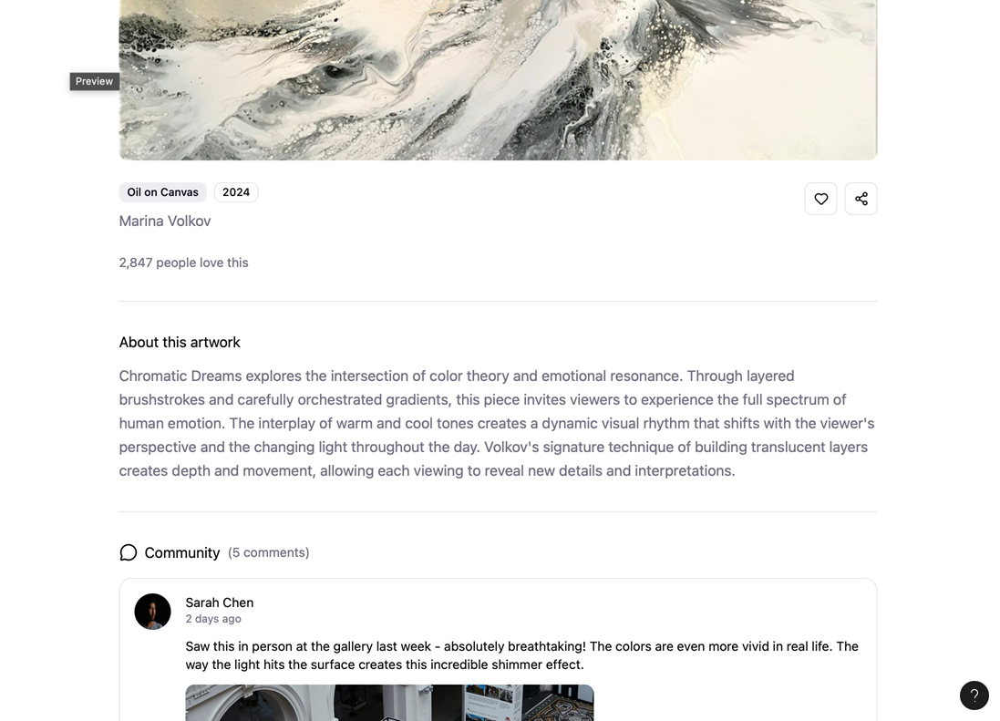
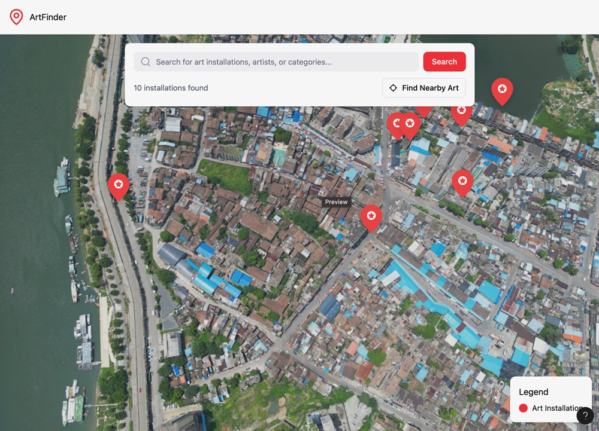
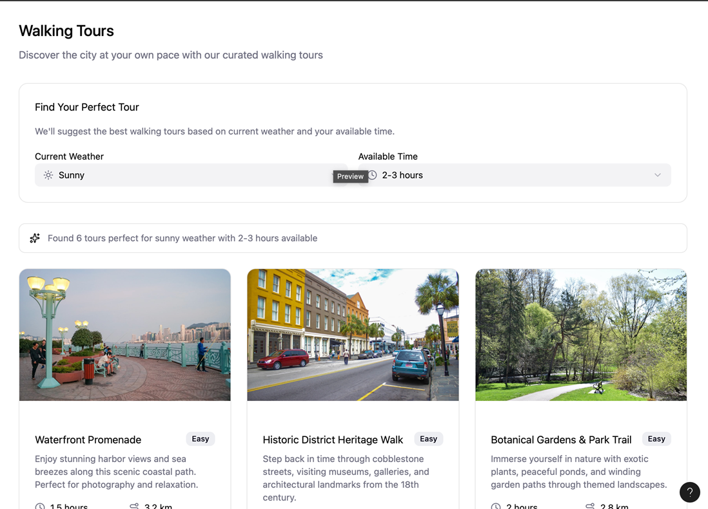

# Cincy Public Art Finder

## Introduction

Cincy Public Art Finder is a web application designed to help residents and tourists discover and explore the rich collection of public art, murals, and statues across Cincinnati. Users can find art locations, view details, and get curated walking tours based on their location and current weather conditions. The application also allows users to "check in," leave comments, and submit their own photos, creating a community-driven guide to the city's art scene.

## Icon/Logo

## Storyboard

Below is a simple storyboard stating plans for a user interface and  features.These mockups show the flow between the Home Page, Art Detail Page, and Walking Tour Page.

| Screen            | Description                        | Example Image                           |
| ----------------- | -----------------------------------| --------------------------------------- |
| Home Page         | Displays a city map with pins representing art installations near the user. Includes a search bar and “Find Nearby Art” button. |   |
| Art Detail Page   | Shows art name, image, description, and community comments/photos.                                                              |  |
| Walking Tour Page | Suggests tour routes based on weather and time availability.                                                                    |      |

## Project Management:

Our team uses GitHub Projects to organize and track work progress.

## Requirements

### Requirement 1: View Nearby Art on a Map

As a tourist, I want to see a map of art installations near me, so that I can easily find and navigate to them.
- Given I have allowed location services,
When I load the homepage,
Then the map centers on my location and displays pins for nearby art.
- Given I disable location permissions,
When I load the homepage,
Then the map prompts me to enter a ZIP code or neighborhood manually.

### Requirement 2: View Art Details

As a user, I want to tap on an art installation’s map pin, so that I can see its name, a picture, and a short description.
- Given I am viewing the art map,
When I click a pin,
Then a pop-up or sidebar appears with the art’s details.
- Given I click the “More Info” button,
When the details load,
Then I can view related comments and photos.

### Requirement 3: Weather-Based Walking Tours

As a user, I want to know if it’s a good time for a walking tour, so that I can plan my day.
- Given the app fetches weather data,
When I open the “Tours” page,
Then I see a message like “It’s a great day for a walk!” or “It’s raining, try an indoor gallery instead.”
- Given I choose “30-minute tour,”
When weather conditions are clear,
Then a route of 5–6 nearby murals appears.

### Requirement 4: Community Interaction

As a user, I want to leave a comment or upload a photo on an art’s detail page, so that I can share my experience with others.
- Given I am on an art detail page,
When I fill out the “Add Comment” form and click submit,
Then my comment appears instantly under the art.
- Given I upload a photo,
When the upload completes,
Then the image displays in the user photo gallery.

### Requirement 5: View User-Submitted Photos

As a user, I want to view user submitted photos, so that I can see the art in different seasons or times of day.
- Given I am on an art’s detail page,
When I click the “User Photos” tab,
Then I see a gallery of community photos.
- Given I scroll the gallery,
When I click a photo,
Then a full-screen preview appears.

## Data Sources
| Type            | Description                        | Example URL                          |
| ----------------- | -----------------------------------| --------------------------------------- |
Public JSON Source 1 |	Cincinnati Open Data Portal will provide us data for public art, murals, and historical landmarks.| https://data.cincinnati-oh.gov/resource/art-locations.json
Public JSON Source 2 | OpenWeatherMap API will provide us with real-time weather conditions used for walking tour suggestions. |	https://api.openweathermap.org/data/2.5/weather
External Group API	| JSON API from another student group. | TBD
Produced JSON (Cincy art finder API) |	Our application will expose its own API for user content such as comments, ratings, and photos. This will be documented with OpenAPI.| example: ----https://cincyartfinder.uc.edu/api/comments

## Team Composition

- Cheikh Abdoul
- Oladele Awonusi
- Taiwo Mudah
- Pushpa Priya Sripathi

Weekly Meeting Time and Format:
Mondays at 2:00 PM EST via Microsoft Teams

## Collaboration Tools:

- GitHub 
- Visual Studio 2022 
- Figma / PowerPoint 
- Microsoft Teams

  
## References

Example repositories for structure and Markdown formatting:
- MyPlantDiaryQ
- PlantDiary
